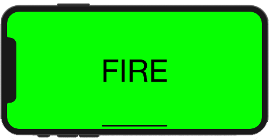
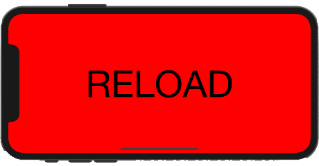

# Shotgun

Shotgun is an iOS motion gesture app. This project was an idea I got when I was thinking about existing apps that were simple enough for me to recreate. I somehow stumbled upon the thought of the old shotgun gesture apps, and so I went to work. This was my first time working with the MVC architecure, as simple as it was, I really take pride in that fact that I was able to utilize the MVC pattern into this project. Prior to this, I had been studying/reading/practicing the MVC and MVVM patterns. In Shotgun, you first tap on reload to load the shotgun--then somewhat-violently--cock your iPhone upwards and back to simulate gun recoil, which then plays a shotgun sound effect.

I was extremely happy with how the app turned out, especially with Shotgun being one of my first apps that could be on the App Store. I'm proud of that I was able to correctly utilize the MVC architecure pattern whil utilizing variable closures and UIEvent motion gestures.

